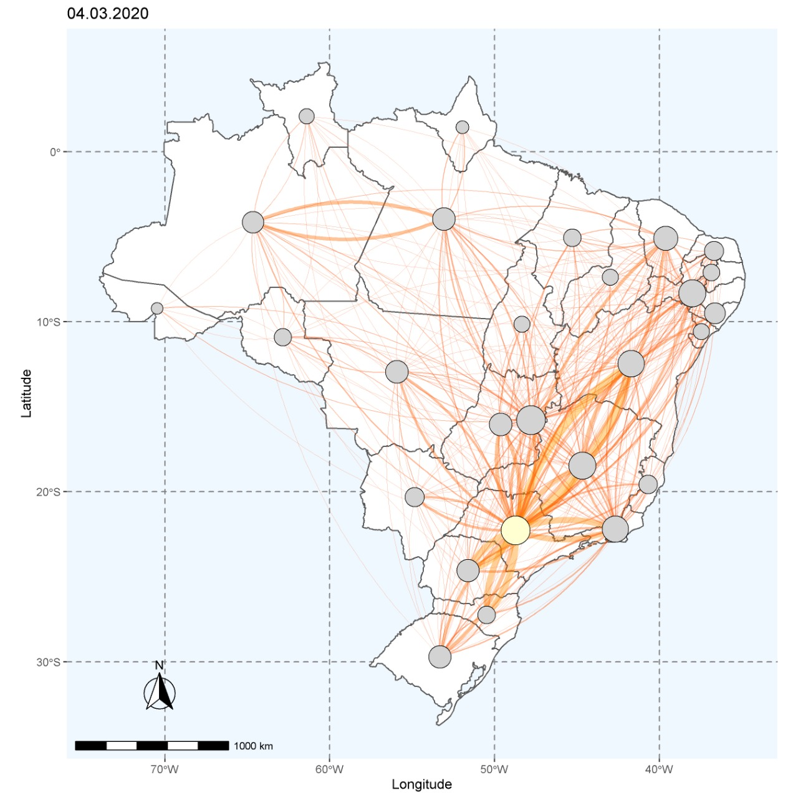
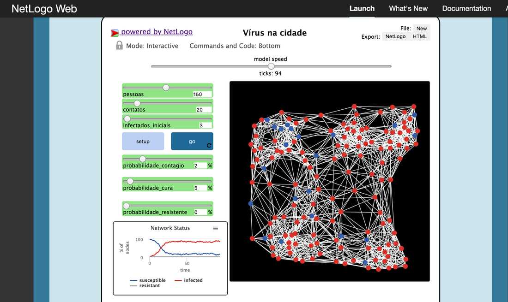

```{r setOptions, include=FALSE, message=FALSE}
library(flexdashboard)
#library(xtable)
library(knitr)
#library(plotly)
options(OutDec = ',')
knitr::opts_chunk$set(echo=FALSE, warnings=FALSE, message=FALSE, fig.width=3,
                      fig.height=2, fig.align="center")
```

<div class="container">

<div class="item2">
  <h4><a href="projecao.html" id="casos">Quantos casos notificados no Brasil? Quantos serão notificados nos próximos dias? </a></h4>
  <a href="projecao.html">
```{r , fig.width = 6, fig.height=4}
plot.forecast.exp
```
  </a>
</div>

<div class="item">
  <h4><a href="pais.html">Como epidemias se espalham por um país continental?</a></h4>
 
 <a href="pais.html">
   
 </a>
  
  A chave pode estar na rede formada por aeroportos e vôos conectando os estados.
  
 </div>

<div class="item">
  <h4><a href="perguntas.html">Respostas da nossa equipe para algumas das principais perguntas sobre COVID-19</a></h4>
 
  <a href="perguntas.html">
 
   </a>
 
  
  Confira aqui em nossa nova seção.
</div>


<div class="item">
  <h4><a href="#" id="tduplica">Quão rápido a doença se propaga?</a></h4>
No momento não é possível estimar tempos de duplicação da epidemia, pois há um enorme acúmulo de testes moleculares sem resultados, necessários para que os casos sejam confirmados e notificados. Essa demora faz com que os números disponíveis publicamente (número de notificações) cresça de maneira artificialmente lenta.

Assim, a evolução do números oficiais informa hoje sobre a dinâmica de notificação, não da epidemia. Seria irresponsável seguir divulgando medidas de propagação da epidemia no Brasil com esses números.
  
 <!-- <a href="propagacao.html">
  
   ```{r}
   plot.tempo.dupl + theme(axis.text.x = element_text(size = 10),
                        axis.title.y = element_text(size = 8))
   ```
  </a>
</div>-->

<!--<div class="item">
  <h4><a href="transmissao.html">Para quantas pessoas cada infectado transmite a doença?</a></h4>
  <a href="transmissao.html">-->
<!--```{r}-->
<!--plot.estimate.R0 + theme(axis.text.x = element_text(size = 10),-->
<!--                        axis.title.y = element_text(size = 8))-->
<!--```-->
<!--  </a>-->
</div>

<div class="item">
  <h4><a href="dinamica.html">Como o isolamento social influencia a dinâmica de propagação da epidemia?</a></h4>
 
  <a href="dinamica.html">
 
   </a>
 
  
  O isolamento social reduz a propagação de uma doença
  contagiosa. 
</div>


<!--<div class="item">
  <h4><a href="leitos.html">Em quanto tempo 100% dos leitos de São Paulo estariam ocupados com COVID-19 sem distanciamento social?</a></h4>
 
  <a href="leitos.html">
 
   </a>
 
  Sem nenhuma medida de controle de contágio, os leitos hospitalares da cidade de São Paulo teriam sido completamente ocupados por pacientes de COVID-19 no dia 06 de abril.
  
</div>-->


</div>
