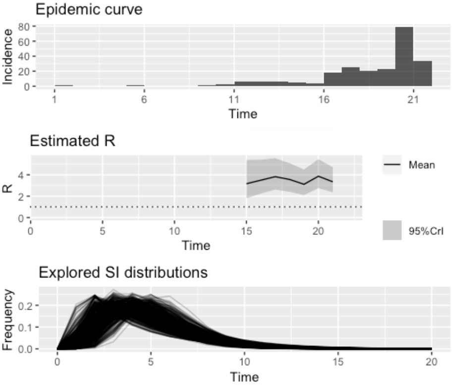

# Informações

<h2>Estimativa de R0</h2>

Em epidemiologia, uma das medidas mais importantes é o número reprodutivo basal ou razão de reprodução básica (R0). Essa medida indica o número de casos secundários que um indivíduo infeccioso pode gerar em uma população totalmente suscetível. Apesar de ser muito útil para avaliar o potencial de propagação de doenças infecciosas em diferentes contextos, R0 é uma medida teórica. Com a propagação de doenças infecciosas com altas taxas de transmissibilidade, muitas pessoas se infectam e, em diversos casos, indivíduos que já foram infectados podem tornar-se resistentes, não pertencendo mais ao grupo de suscetíveis. Neste momento, a premissa de uma população totalmente suscetível passa a não ser mais uma boa aproximação da realidade e uma nova medida epidemiológica faz-se necessária. Essa medida é o número reprodutivo efetivo ou razão de reprodução efetiva (Re). Esse número indica o número de casos secundários produzidos em uma população na qual nem todos são suscetíveis. Para analisar a dinâmica instantânea de uma doença infecciosa que tem potencial de infectar grande parte da população, o valor de Re calculado continuamente pode informar o quão crítico é o atual estágio de uma determinada epidemia. Podemos calcular o Re utilizando séries temporais de dados de incidência e a distribuição do intervalo serial, definido como o intervalo de tempo entre o início da doença em um caso primário e o início da doença em um caso secundário. Entretanto, esta medida é difícil de ser obtida, principalmente para doenças infecciosas com pouco estudo epidemiológico. Para contornar esse problema, pode-se estimar o valor de Re considerando incertezas na medida do intervalo serial. Consideramos aqui a série temporal dos últimos 7 dias da epidemia de COVID-19 no contexto brasileiro, estimamos diariamente os valores de Re utilizando a metodologia apresentada por Wallinga e Teunis, 2004 e implementada no pacote EpiEstim* do software R (Figura). Para a medida de intervalo serial, utilizamos uma distribuição log-normal truncada com média 4.8 (IC 95%, 3.8 - 6.1) e desvio padrão 2.3 (IC 95%, 1.6 - 3.5) em conformidade com o estudo Nishiura et al., 2020.

{ width=30% }
 

<h4>Referências</h4>

Wallinga J and Teunis P. Different Epidemic Curves for Severe Acute Respiratory Syndrome Reveal Similar Impacts of Control Measures, American Journal of Epidemiology, Volume 160, Issue 6, 15 September 2004, Pages 509–516, https://doi.org/10.1093/aje/kwh255

Nishiura H, Linton NM, Akhmetzhanov AR, Serial interval of novelcoronavirus (COVID-19) infections. International Journal of Infectious Diseases, 2020. doi: https://doi.org/10.1016/j.ijid.2020.02.060
 
*Pacote EpiEstim no R: https://cran.r-project.org/web/packages/EpiEstim/index.html
